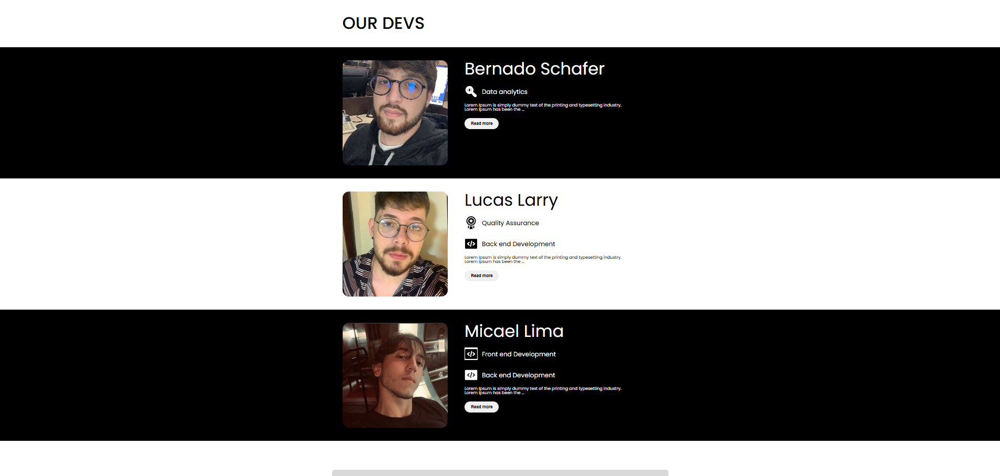

# 👨‍💻 Our Devs

Este projeto é uma página web simples para apresentar desenvolvedores,
suas habilidades e permitir contato através de um formulário.\
Além disso, cada card de dev possui um botão **"Read more / Read less"**
que expande ou recolhe a biografia.

------------------------------------------------------------------------

## 📸 Preview

\

------------------------------------------------------------------------

## ⚙️ Funcionalidades

-   Exibição de cards com informações de cada dev.\
-   Botão **Read more / Read less** que mostra a descrição completa.\
-   Formulário de contato com **validação em JavaScript**:
    -   Nome deve conter pelo menos 2 palavras.\
    -   E-mail precisa ser válido.\
    -   Descrição com no mínimo 10 caracteres.\
-   Alertas para erros e confirmação de envio.

------------------------------------------------------------------------

## 🛠️ Tecnologias Utilizadas

-   **HTML5** → estrutura da página\
-   **CSS3** → estilização e layout\
-   **JavaScript (ES6)** → validação do formulário e efeito "Read more"

------------------------------------------------------------------------

## 📂 Estrutura do Projeto

    .
    ├── assets
    │   ├── css
    │   │   ├── common/styles.css
    │   │   └── home/home.css
    │   ├── img/
    │   └── svg/
    ├── index.html
    ├── main.js

------------------------------------------------------------------------

## 🚀 Como rodar o projeto localmente

1.  Clone este repositório:

    ``` bash
    git clone https://github.com/lucaslarry/javaScript-Faculdade-fase1.git
    ```

2.  Acesse a pasta do projeto:

    ``` bash
    cd javaScript-Faculdade-fase1
    ```

3.  Abra o arquivo `index.html` no navegador:

    -   Clique duas vezes nele, ou\
    -   Rode com uma extensão como **Live Server** (VS Code).

------------------------------------------------------------------------

✨ Feito com dedicação pelo time de devs.
